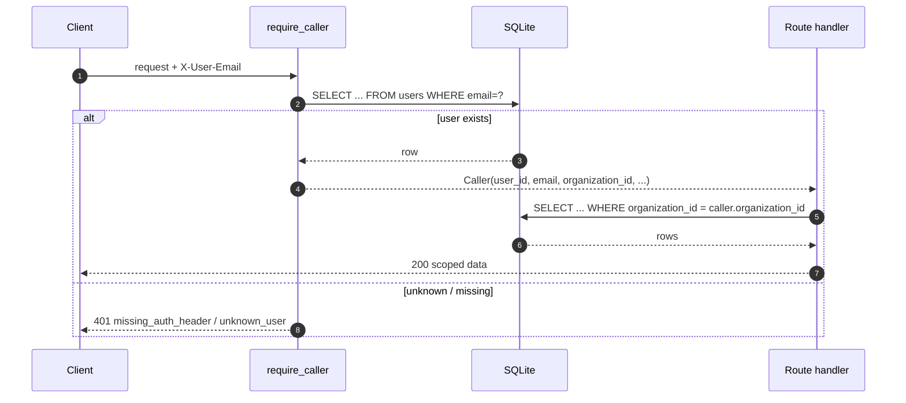

# Auth & Org Scoping

## Auth model (dev)

This is a **local/dev** auth layer, not production identity. There are no
passwords, tokens, signatures, or sessions. The contract:

1. Every protected request must include header `X-User-Email: <email>`.
2. The server looks up that user in the `users` table.
3. The caller's `organization_id` is derived from that row.
4. The caller context (`Caller` dataclass) is attached to the request via
   FastAPI's `Depends(require_caller)`.

**No body or query parameter can override the caller's resolved
`organization_id`.** Attempts to do so are rejected with 403.

### Source
- Dependency: `apps/api/app/auth.py` — `require_caller`, `ensure_same_org`, `Caller`.
- Applied in: `apps/api/app/api/routes.py` on every encounter route and `/me`.

### Responses

| Situation                                    | HTTP | Detail                           |
|----------------------------------------------|------|----------------------------------|
| Missing / empty `X-User-Email`               | 401  | `missing_auth_header`            |
| Unknown email                                | 401  | `unknown_user`                   |
| Caller's org ≠ target org (body/query/loc)   | 403  | `cross_org_access_forbidden`     |
| Caller tries to read another org's encounter | 404  | `encounter_not_found`            |

## Scoping model

| Route                                     | Scoping                                                |
|-------------------------------------------|---------------------------------------------------------|
| `GET /encounters`                         | WHERE `organization_id = caller.organization_id`. `?organization_id=` param is a lens: if it mismatches the caller → 403. `?location_id=`, `?status=`, `?provider_name=` narrow further within the caller's org. |
| `GET /encounters/{id}`                    | Same row + cross-org check; mismatched → 404.           |
| `GET /encounters/{id}/events`             | Parent-encounter scoped; cross-org → 404.               |
| `POST /encounters`                        | `organization_id` in body must equal caller org → 403 otherwise. Location must also belong to caller org → 403 otherwise. |
| `POST /encounters/{id}/events`            | 404 if cross-org.                                       |
| `POST /encounters/{id}/status`            | 404 if cross-org. Strict state machine applies after scope check. |
| `GET /me`                                 | Auth-only; echoes resolved caller.                      |
| `GET /organizations`, `/locations`, `/users` | **NOT scoped** this phase — intentional, documented. |

### 404-vs-403 rule

For encounter reads/mutates, cross-org access returns **404** (same shape
as "really doesn't exist") so attackers cannot distinguish "exists in
another org" from "doesn't exist at all." For explicit body/query
assertions that contradict the caller (e.g. `POST /encounters` body
`organization_id=2` while caller is org 1), the server returns **403**
because the intent is unambiguous and should fail loudly.

## Illustrated flow

## What this phase explicitly does NOT do

- No password auth, no JWT, no session cookies.
- No role-based access control (admin vs. clinician etc.) — every seeded
  user currently has `role = "admin"`.
- No rate limiting or audit log beyond the `workflow_events` breadcrumb.
- `/organizations`, `/locations`, `/users` remain unauthenticated.

These are the right handoff points for the *next* auth phase.
