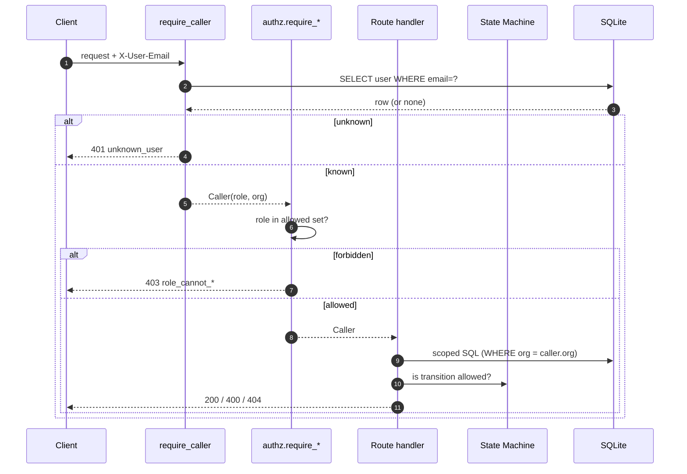

# Auth, Org Scoping, RBAC

## 1. Authentication (authn)

**Source:** `apps/api/app/auth.py`.

- Transport today: request header `X-User-Email: <email>`.
- `require_caller` is a FastAPI dependency that resolves the user from
  the `users` table and returns a `Caller(user_id, email, full_name, role, organization_id)`.
- Environment flag `CHARTNAV_AUTH_MODE` (default `"header"`) is the
  **production upgrade seam**. When JWT/SSO lands, only the body of
  `require_caller` (or a new branch in it) changes. Every route and
  every RBAC helper continues to work unchanged because they depend on
  `Caller`, not on any header.

### Dev-only, explicitly

`X-User-Email` is trivially spoofable. This is acceptable for local
development only. **Do not deploy this to a shared environment
without first swapping the transport.** The seam is there; use it.

### Standardized error envelope

Every auth/authz error returns:
```json
{"detail": {"error_code": "<stable_code>", "reason": "<human message>"}}
```

### Authn error codes

| Code                    | HTTP | When                                            |
|-------------------------|------|-------------------------------------------------|
| `missing_auth_header`   | 401  | `X-User-Email` absent or empty.                 |
| `unknown_user`          | 401  | Email not found in `users`.                     |
| `auth_mode_unsupported` | 500  | `CHARTNAV_AUTH_MODE` set to something unwired.  |

## 2. Authorization (authz / RBAC)

**Source:** `apps/api/app/authz.py`.

### Roles

| Role        | Intent                                          |
|-------------|-------------------------------------------------|
| `admin`     | Full read/write inside own org.                 |
| `clinician` | Charting side of the workflow.                  |
| `reviewer`  | Review side of the workflow; read-only on create/events. |

All seeded users today carry exactly one of these roles.

### Permission surface

| Surface                        | admin | clinician | reviewer |
|--------------------------------|:-----:|:---------:|:--------:|
| Read org / locations / users   |   ✓   |     ✓     |    ✓     |
| List / read encounters         |   ✓   |     ✓     |    ✓     |
| Read encounter events          |   ✓   |     ✓     |    ✓     |
| Create encounter               |   ✓   |     ✓     |    ✗     |
| Add workflow event             |   ✓   |     ✓     |    ✗     |
| Transition scheduled→in_progress  | ✓ |     ✓     |    ✗     |
| Transition in_progress→draft_ready | ✓ |    ✓     |    ✗     |
| Transition draft_ready→in_progress (rework) | ✓ | ✓ |   ✗     |
| Transition draft_ready→review_needed | ✓ |    ✗     |    ✓     |
| Transition review_needed→draft_ready (kick back) | ✓ | ✗ | ✓ |
| Transition review_needed→completed   | ✓ |    ✗     |    ✓     |

### Authz dependencies

- `require_roles(*roles)` — generic gate, returns `Caller`.
- `require_create_encounter` — applied to `POST /encounters`.
- `require_create_event` — applied to `POST /encounters/{id}/events`.
- `assert_can_transition(caller, from, to)` — called by the status
  handler **after** the state machine accepts the edge.

### Authz error codes

| Code                           | HTTP | When                                            |
|--------------------------------|------|-------------------------------------------------|
| `role_forbidden`               | 403  | Generic `require_roles` denies.                 |
| `role_cannot_create_encounter` | 403  | Non-admin/clinician POSTs `/encounters`.        |
| `role_cannot_create_event`     | 403  | Non-admin/clinician POSTs event.                |
| `role_cannot_transition`       | 403  | Role may not drive that specific state edge.    |

## 3. Org scoping

Caller's `organization_id` is **authoritative**. Bodies and query
strings cannot override it.

| Route                                     | Scoping                                      |
|-------------------------------------------|----------------------------------------------|
| `GET /organizations`                      | `WHERE id = caller.org`                      |
| `GET /locations`                          | `WHERE organization_id = caller.org`         |
| `GET /users`                              | `WHERE organization_id = caller.org`         |
| `GET /encounters`                         | `WHERE organization_id = caller.org` + filters |
| `GET /encounters/{id}`                    | 404 if row is cross-org                      |
| `GET /encounters/{id}/events`             | 404 if parent cross-org                      |
| `POST /encounters`                        | Body `organization_id` must equal caller's; location must belong |
| `POST /encounters/{id}/events`            | 404 if cross-org                             |
| `POST /encounters/{id}/status`            | 404 if cross-org                             |

### 404 vs 403

- **404** when the target might-or-might-not exist in another org —
  returning 403 there would leak existence.
- **403** when the client explicitly asserts a different org (body or
  `?organization_id=`) — the intent is unambiguous, fail loudly.

## 4. Diagram



## 5. Status as of phase 10

- **JWT bearer mode is now implemented** (see `11-production-auth-seam.md`). Real signature + issuer + audience + expiry validation against a JWKS URL.
- **Dedicated audit trail** in `security_audit_events` for denied/suspicious access (see `18-operational-hardening.md`).
- **Rate limiting** on authed paths (see `18-operational-hardening.md`).
- Still TODO: scoped writes to organizations/locations/users, per-tenant key management.

## 6. What this phase explicitly does NOT do

- No password auth (IdP owns identity proof).
- No refresh-token flow or revocation list.
- No per-tenant JWKS — single issuer + single JWKS URL.
