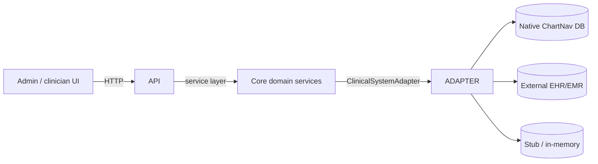

# Platform Mode & Interoperability

ChartNav ships with an explicit architectural seam so it can run as a
standalone lightweight EMR/EHR **or** sit on top of an existing EMR/EHR
as a workflow / documentation / orchestration layer. No code path
assumes one deployment shape.

## 1. Operating modes

Driven by `CHARTNAV_PLATFORM_MODE`. Three values, each with a concrete
contract:

| Mode                      | ChartNav is …                  | Clinical SoR      | Writes to external system? |
|---------------------------|--------------------------------|-------------------|----------------------------|
| `standalone`              | the system of record           | ChartNav DB       | N/A                        |
| `integrated_readthrough`  | a read-through layer + native workflow | external EHR/EMR | **No** (explicitly refused) |
| `integrated_writethrough` | a read + write layer           | external EHR/EMR (mirrored in ChartNav when cached) | **Yes** (via the adapter) |

Selection:

```bash
# Standalone (default — current build)
export CHARTNAV_PLATFORM_MODE=standalone

# Read-only overlay on top of an existing EHR/EMR
export CHARTNAV_PLATFORM_MODE=integrated_readthrough
export CHARTNAV_INTEGRATION_ADAPTER=stub   # or a vendor key

# Read + write overlay
export CHARTNAV_PLATFORM_MODE=integrated_writethrough
export CHARTNAV_INTEGRATION_ADAPTER=stub   # or a vendor key
```

The config layer (`app/config.py`) validates the combination at
import time and fails loudly on mismatch (e.g.
`standalone + adapter=stub` → RuntimeError).

## 2. Adapter layer

The boundary between ChartNav's core and an external clinical system
is a single Python protocol: `app.integrations.base.ClinicalSystemAdapter`.
Core services **never** talk to a vendor SDK, DB driver, or HTTP
client directly. They talk to an adapter.

### 2.1 Shipped adapters

| Key        | Module                                 | Use                                    | `list_encounters` | `fetch_encounter` | `update_encounter_status` |
|------------|----------------------------------------|----------------------------------------|:--:|:--:|:--:|
| `native`   | `app/integrations/native.py`           | Standalone — ChartNav DB is SoR        | ✓ | ✓ | ✓ |
| `stub`     | `app/integrations/stub.py`             | Integrated without a real vendor yet   | ✓ (canned) | ✓ | write-through only |
| `fhir`     | `app/integrations/fhir.py` (phase 18)  | Generic FHIR R4 read-through           | ✓ (`GET /Encounter`) | ✓ (`GET /Encounter/<id>`) | ✗ `AdapterNotSupported` |

Both implementations are honest:

- `NativeChartNavAdapter` reuses the same SQLAlchemy Core query
  surface the HTTP routes use. It refuses `fetch_patient` /
  `search_patients` today because a native `patients` table is not
  yet modeled — documented and test-asserted.
- `StubClinicalSystemAdapter` exposes a canned read shape so the UI
  can render an integrated deployment end-to-end. In read-through
  mode it raises `AdapterNotSupported` on every write; in
  write-through mode it records writes to an in-process list
  (inspectable in tests) but never pretends to have reached a real
  external system.

### 2.2 Adding a vendor adapter

1. Create `app/integrations/<vendor>.py`. Implement
   `ClinicalSystemAdapter`. Raise `AdapterError("error_code", "…")`
   for transport/auth/validation failures and `AdapterNotSupported`
   for operations the vendor doesn't support.
2. Register a factory:

   ```python
   from app.integrations import register_vendor_adapter
   from app.integrations.vendor_x import VendorXAdapter

   register_vendor_adapter("vendor_x", lambda: VendorXAdapter())
   ```

3. Set `CHARTNAV_INTEGRATION_ADAPTER=vendor_x`. Nothing else in the
   core changes.

The registry is a plain dict — deliberately mutable, deliberately
grep-able. No decorator magic, no import-time side effects hidden in
the core.

### 2.3 What the contract expresses

The protocol is small by design. Current surface:

- `fetch_patient(patient_id)` / `search_patients(query, limit)`
- `fetch_encounter(encounter_id)`
- `update_encounter_status(encounter_id, new_status, *, changed_by)`
- `write_note(encounter_id, author_email, body, note_type)`
- `sync_reference_data()`
- `info` → `AdapterInfo` (supports-* flags + source-of-truth map)

Adding operations is cheap; removing them later is hard. Resist
speculative additions.

## 3. Source-of-truth model

Each shipped adapter declares, per domain object, who owns the
canonical copy:

| Object         | `native` | `stub` (integrated) |
|----------------|----------|---------------------|
| organization   | ChartNav | mirrored            |
| location       | ChartNav | mirrored            |
| user           | ChartNav | ChartNav            |
| encounter      | ChartNav | external            |
| workflow_event | ChartNav | ChartNav            |
| patient        | not supported | external       |
| document       | ChartNav | external            |

This map is surfaced at `GET /platform` and rendered in the admin
panel so the semantics of a given install are never implicit.

## 4. Request flow



In standalone mode the adapter path terminates at the native DB;
in integrated modes it terminates at the vendor (or the stub).

## 5. Runtime validation

At import time `app/config.py` enforces:

- `CHARTNAV_PLATFORM_MODE` ∈ {standalone, integrated_readthrough, integrated_writethrough}.
- `standalone` **forbids** any adapter other than `native`.
- `integrated_*` defaults the adapter to `stub` when unset.

At adapter resolution time `app/integrations/__init__.py::resolve_adapter`:

- Returns the singleton matching the configuration.
- Raises `RuntimeError` with an actionable message when an
  integrated mode asks for a vendor key that isn't registered.

## 6. HTTP surface

`GET /platform` (auth required):

```json
{
  "platform_mode": "standalone",
  "integration_adapter": "native",
  "adapter": {
    "key": "native",
    "display_name": "ChartNav native",
    "description": "…",
    "supports": {
      "patient_read": false,
      "patient_write": false,
      "encounter_read": true,
      "encounter_write": true,
      "document_write": true
    },
    "source_of_truth": {
      "encounter": "chartnav",
      "patient": "not_supported",
      "…": "…"
    }
  }
}
```

No secrets leak — JWT config, DB URL, and vendor credentials never
appear on this surface. The test suite asserts that explicitly.

## 7. Frontend awareness

The admin panel renders a **platform banner** at the top (inside the
modal, above the tabs) on every admin view:

```
Platform mode: Standalone (ChartNav-native) · ChartNav native
```

Derived entirely from `GET /platform`. Changes the minute an operator
flips `CHARTNAV_PLATFORM_MODE` and restarts the API. Frontend test
coverage in `src/test/AdminPanel.test.tsx` proves standalone and
integrated-readthrough render distinctly.

## 8. What this phase explicitly does NOT do

- Does **not** implement a real Epic / Cerner / Nextech / Athena
  adapter. The contract exists; vendor work plugs into the registry.
- Does **not** ship a native `patients` table. Standalone mode owns
  encounters, workflow_events, users, locations, organizations, and
  documents-as-workflow-events today. Patient modeling is the
  obvious next standalone-mode build.
- Does **not** implement FHIR. The adapter contract maps cleanly to
  a subset of FHIR resources (Patient, Encounter, DocumentReference),
  but translating the wire format is the vendor adapter's job.
- Does **not** implement conflict resolution between mirrored caches
  and external writes. That's a real integration concern that
  belongs to each vendor adapter, not the core.

## 9. Adoption path

See `27-adoption-and-implementation-model.md` for how a clinic moves
through these modes over time.
