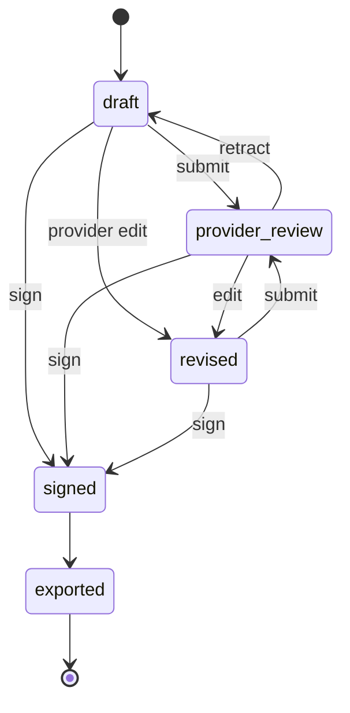

# Transcript → Findings → Note Draft → Signoff (phase 19)

The ChartNav wedge becomes real in this phase. ChartNav is now an
operational layer that takes encounter input, extracts structured
ophthalmology facts, generates a note draft, and walks the provider
through review, edit, sign, and export — without pretending to be a
certified EMR.

## 1. Trust model — three persistent tiers

The three stages have separate tables **and** separate UI surfaces so
the operator can always tell what came from the transcript, what the
generator extracted, and what the provider actually attested to.

| Tier | Table | Owner | Mutable after signoff? |
|------|-------|-------|:--:|
| 1. transcript | `encounter_inputs`   | operator who ingested | ❌ (audit-preserving) |
| 2. findings   | `extracted_findings` | generator             | ❌ (re-generate = new row) |
| 3. draft/final| `note_versions`      | provider (after edits) | ❌ once `signed` |

Regeneration never overwrites. Every regeneration creates a NEW
`extracted_findings` + a NEW `note_versions` row with the next
`version_number`. The UI exposes a version picker so reviewers can
inspect how the draft evolved.

## 2. Data model

### `encounter_inputs`

Raw source of record for "what came out of the encounter."

| column              | notes |
|---------------------|-------|
| `input_type`        | `audio_upload` \| `text_paste` \| `manual_entry` \| `imported_transcript` |
| `processing_status` | `queued` \| `processing` \| `completed` \| `failed` \| `needs_review` |
| `transcript_text`   | nullable — null until STT completes for audio |
| `confidence_summary`| optional vendor signal |
| `source_metadata`   | JSON blob (filename, duration, STT engine, …) |
| `created_by_user_id`| audit trail |

Default statuses:
- `text_paste`, `manual_entry`, `imported_transcript` → **completed** on arrival.
- `audio_upload` → **queued** (future STT worker flips to `processing` → `completed`).

### `extracted_findings`

Structured ophthalmology facts. Separate from narrative so audits can
compare "what the generator saw" vs "what the note said."

Top-level columns cover ophthalmology essentials:
`chief_complaint`, `hpi_summary`, `visual_acuity_od`, `visual_acuity_os`,
`iop_od`, `iop_os`, `extraction_confidence`.

`structured_json` carries the rest as a single JSON blob so the schema
stays honest about what isn't first-class yet: `diagnoses[]`,
`medications[]`, `imaging[]`, `assessment`, `plan`,
`follow_up_interval`, custom flags.

### `note_versions`

Versioned note drafts. Only one state at a time per `(encounter_id,
version_number)`.

Status machine:



Key invariants:
- `draft_status ∈ {signed, exported}` → **immutable**. PATCH returns
  409 `note_immutable`. Regenerate to get a new version.
- A provider PATCH to `note_text` while the note is `draft` auto-flips
  `generated_by → manual` and `draft_status → revised`. The UI can
  always tell the difference between generator output and
  provider-edited content.
- Only `admin` + `clinician` can sign. Reviewers read only — enforced
  at both the UI (hides the Sign button, shows a disabled-note) and
  the API (`role_cannot_sign` 403).
- Export is a **separate state** from sign. An exported note was
  signed *and* handed off (copy / download / upstream push).

### Linkage

`note_versions.source_input_id` and `note_versions.extracted_findings_id`
point at the exact tier-1 / tier-2 rows this version was generated
from, preserving full lineage even after regeneration.

## 3. Generator seam

`app/services/note_generator.py::generate_draft(...)` is the **one
place** a real LLM plugs in. Today's body is a deterministic regex
extractor + SOAP template so the full encounter→signoff workflow can
be exercised with zero external dependencies.

Output contract (stable across implementations):

```python
@dataclass(frozen=True)
class GenerationResult:
    findings: dict[str, Any]     # matches extracted_findings shape
    note_text: str               # narrative body
    missing_flags: list[str]     # e.g. ["iop_missing", "plan_missing"]
```

Honest limitations of the shipped fake:
- only extracts values the transcript literally contains.
- emits `<missing — provider to verify>` placeholders rather than
  invented values.
- the missing-flags list feeds the UI's "items for provider to
  verify" banner so the provider can't miss that something was absent.

To swap in a real model, replace `_run_generator` and keep the
contract. Everything else stays.

## 4. HTTP surface

All endpoints are org-scoped via the existing encounter RBAC.
Cross-org access returns 404 (never 403) to avoid leaking existence.

| Method | Path | Role | Notes |
|--------|------|------|-------|
| `POST` | `/encounters/{id}/inputs` | admin, clinician | Creates `encounter_inputs` row |
| `GET`  | `/encounters/{id}/inputs` | any authed | List all inputs for the encounter |
| `POST` | `/encounters/{id}/notes/generate` | admin, clinician | Creates `extracted_findings` + `note_versions` v+1 |
| `GET`  | `/encounters/{id}/notes` | any authed | List all versions (DESC) |
| `GET`  | `/note-versions/{id}` | any authed | Returns `{note, findings}` |
| `PATCH`| `/note-versions/{id}` | admin, clinician | Edits; auto-flips to `revised` + `generated_by=manual` |
| `POST` | `/note-versions/{id}/submit-for-review` | admin, clinician | `draft|revised → provider_review` |
| `POST` | `/note-versions/{id}/sign` | admin, clinician | Stamps `signed_at` + `signed_by_user_id` |
| `POST` | `/note-versions/{id}/export` | admin, clinician | `signed → exported`; stamps `exported_at` |

Audit events emitted: `encounter_input_created`, `note_version_generated`,
`note_version_submitted`, `note_version_signed`, `note_version_exported`.

New error codes: `invalid_input_type`, `transcript_required`,
`invalid_processing_status`, `input_not_found`, `input_not_ready`,
`no_completed_input`, `invalid_note_format`, `invalid_note_status`,
`invalid_note_transition`, `note_immutable`, `role_cannot_sign`,
`note_already_signed`, `note_not_signed`, `note_not_found`.

## 5. Provider review UI

`apps/web/src/NoteWorkspace.tsx` renders three visually distinct tiers
inside the encounter detail pane:

- **Tier 1 — Transcript input**: chip list of inputs with processing
  status. Operators can paste a transcript inline and click
  **Generate draft**.
- **Tier 2 — Extracted findings**: read-only definition list +
  confidence pill (color-coded: green high / blue medium / amber low)
  + a **missing-data checklist** the provider must verify before
  signing.
- **Tier 3 — Note draft**: editable textarea when status ≠
  signed/exported; read-only `<pre>` once signed. Status chip + version
  number. A trust-breadcrumb at the top of the workspace spells out
  `transcript → extracted facts → AI draft → provider signed`.

Actions are ordered left-to-right to match the workflow: Save edit →
Submit for review → Sign → Export (or Copy). Signing reveals the
Export button; exporting downloads a `chartnav-note-<encounter>-v<n>.txt`
file.

Reviewer role: no Sign button, a small subtle-note explains that
clinician attestation is required.

Version list renders below the draft once v2+ exists; clicking a
version swaps the active view without losing the others.

## 6. Export / handoff

Today's export is honest:

1. `/note-versions/{id}/export` stamps `exported_at` and flips status.
2. UI downloads a `.txt` file of the signed body.
3. UI offers a **Copy to clipboard** button for paste-into-EHR flow.

What's explicitly **not** shipped:
- No `DocumentReference` write-back to FHIR — the FHIR adapter
  (phase 18) still raises `AdapterNotSupported` on `write_note`. A
  vendor-specific adapter layers the push on top.
- No PDF/HL7 export. Plain text covers paste-into-EHR without
  pretending to own a vendor-certified format.

## 7. Verification matrix

| Command | Result |
|---------|--------|
| `make verify` (SQLite) | ✅ **174/174 pytest + 9/9 smoke** |
| `npm run typecheck` | ✅ clean |
| `npm test` (Vitest) | ✅ **42/42** |
| `npm run build` | ✅ 206 KB JS / 17.5 KB CSS |
| `npx playwright test workflow + a11y` | ✅ 17/17 |
| `npx playwright test visual --update-snapshots` | ✅ 4/4 (baselines refreshed) |
| Generator on a rich transcript | ✅ extracts VA 20/40, IOP 15/17, CC, plan, follow-up |
| Generator on a sparse transcript | ✅ emits `iop_missing`, `visual_acuity_missing`, `plan_missing` flags |
| Sign immutability | ✅ PATCH on signed → 409 `note_immutable` |
| Reviewer sign | ✅ 403 `role_cannot_sign` |
| Export-before-sign | ✅ 409 `note_not_signed` |
| Cross-org read of note-version | ✅ 404 `note_not_found` |

## 8. What this phase does NOT do

- Does **not** wire a real LLM. Today's generator is a deterministic
  fake; the seam is the one line to change when a real model lands.
- Does **not** implement audio-to-text. `audio_upload` inputs stay
  `queued` until a future STT worker flips them.
- Does **not** ship a scheduling, billing, or patient-portal surface.
- Does **not** claim certification. ChartNav is a workflow overlay,
  not a certified EHR.
- Does **not** implement vendor-specific EHR write-back. Export is a
  handoff state + downloadable text + clipboard, not an automated
  push into a certified record.
