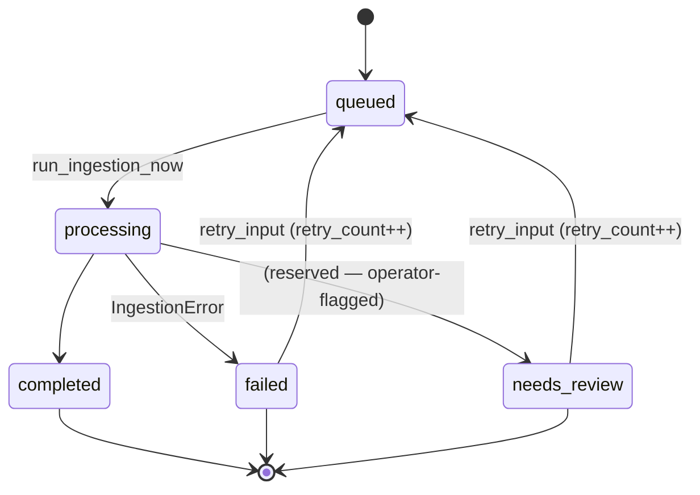

# Async Ingestion + Orchestration Lifecycle (phase 22)

The transcript-to-note wedge now runs through a real async-job
lifecycle instead of flipping rows straight to `completed` on
arrival. Text inputs still look instant to the operator, but they
pass through the same pipeline a future audio STT worker will use —
and every transition, retry, and failure is persisted.

The note generator seam from phase 19 is now wrapped in an explicit
orchestrator, so the HTTP handler never touches the generator
directly. A real LLM drops into one function; the rest of the
pipeline is already shaped.

## 1. Encounter-input state machine

**Invariants**
- `queued` → `processing` is a single DB write. A crashed worker
  never leaves the row in a half-state.
- `processing` rows never re-enter the pipeline without first going
  back through `queued`.
- `retry_count` is incremented only on explicit retry (not on
  initial run).
- `failed` rows always carry `last_error` + `last_error_code` + a
  `finished_at`. Those are cleared on a subsequent success.
- `started_at` / `finished_at` / `worker_id` are always set when
  they should be set; ops can answer "why is this stuck".

## 2. Schema change (migration `c9d0e1f2a304`)

Six columns added to `encounter_inputs` via batch rewrite:

| column            | type               | notes |
|-------------------|--------------------|-------|
| `retry_count`     | INTEGER NOT NULL   | default 0. Incremented only by explicit retry. |
| `last_error`      | TEXT nullable      | cleared on success |
| `last_error_code` | VARCHAR(100) nullable | stable, grep-able codes |
| `started_at`      | DATETIME nullable  | when a worker first entered `processing` |
| `finished_at`     | DATETIME nullable  | terminal-state stamp |
| `worker_id`       | VARCHAR(64) nullable | `"inline"` today; future workers can tag themselves |

No data changes for existing rows (all new cols nullable with
sensible defaults). Standalone + integrated flows unaffected.

## 3. Ingestion service (`app/services/ingestion.py`)

- `run_ingestion_now(input_id, *, worker_id="inline", max_retries=3)`
  synchronously drives one row through the state machine. Safe to
  call from the HTTP request path (tests do). Contract is identical
  to how a future background worker would call it.
- `enqueue_input(input_id)` flips `failed` / `needs_review` → `queued`
  and increments `retry_count`. Idempotent on `queued`. Refuses to
  stomp on `processing`.
- `set_transcriber(fn)` installs a real audio transcriber. Default
  raises `audio_transcription_not_implemented` — audio uploads
  fail honestly instead of pretending to have content.
- Error codes emitted:
  - `input_not_found`
  - `input_not_queueable`
  - `transcript_too_short`
  - `audio_transcription_not_implemented`
  - `transcriber_contract_violation`
  - `invalid_input_type`
  - `unexpected_error`
  - `max_retries_exceeded`

## 4. Orchestrator (`app/services/note_orchestrator.py`)

Sits between the HTTP handler and the deterministic
`note_generator.generate_draft(...)` seam. Enforces the pipeline
contract:

1. resolve the source `encounter_inputs` row (payload input_id or
   most-recent `completed`).
2. assert `processing_status == completed` (else
   `input_not_ready`).
3. call `generate_draft(...)` — the single place to swap in a
   real LLM.
4. persist `extracted_findings` + `note_versions` (version_number
   + 1) in one transaction.

All writes happen inside `engine.begin()`; a generator failure
never leaves a half-written row on disk. Errors raise
`OrchestrationError(error_code, reason, status_code)` which the
HTTP handler forwards verbatim.

## 5. HTTP surface

| Method | Path | Notes |
|---|---|---|
| `POST` | `/encounters/{id}/inputs` | Unchanged contract. Every row now enters at `queued`; text-type inputs run the pipeline inline so existing callers still see `completed` on the response. Audio uploads stay `queued` for a future worker. **Failures are persisted** — the row is created, the response carries `processing_status=failed` + `last_error_code`. |
| `POST` | `/encounter-inputs/{id}/process` | Drive a queued row through the pipeline. Returns `{input, ingestion_error}` — `ingestion_error` is `null` on success, `{error_code, reason}` on failure. |
| `POST` | `/encounter-inputs/{id}/retry` | Flip `failed` / `needs_review` → `queued` + increment retry_count. Emits `encounter_input_retried` audit event. Chain with `/process` for the full retry. |
| `POST` | `/encounters/{id}/notes/generate` | Now delegates to the orchestrator. Same contract. |

Ingest responses now include `retry_count`, `last_error`,
`last_error_code`, `started_at`, `finished_at`, `worker_id`.

## 6. Frontend — honest processing UX

`NoteWorkspace.tsx` (Tier 1) now reflects the full lifecycle:

- Each transcript card shows a status pill reflecting the actual
  `processing_status` (`queued` / `processing` / `completed` /
  `failed` / `needs_review`), color-coded via the brand token
  palette (teal / info-blue / green / red / amber).
- A `retries N` trailing chip appears when `retry_count > 0`.
- A `banner banner--error` renders below the pill when `failed` /
  `needs_review` is set, showing `last_error_code:` + `last_error`.
- A **Retry** button appears on `failed`/`needs_review` rows for
  admin + clinician — runs `retry` then `process` in sequence.
- A **Process now** button appears on `queued` rows — useful for
  audio uploads that haven't been picked up by a worker.
- The **Generate draft** button is now gated: disabled unless at
  least one input is `completed`. The button's title attribute
  explains why it's disabled when it is.

## 7. Tests

Backend (`tests/test_ingestion_lifecycle.py`, +14):
- text paste flows to `completed` with `started_at`/`finished_at`
  stamped.
- too-short transcript → `failed` + `last_error_code` +
  `retry_count=0`.
- audio upload stays `queued` on create.
- audio without transcriber → `failed` with
  `audio_transcription_not_implemented`.
- transcriber seam: `set_transcriber(fn)` flips audio to
  `completed` end-to-end.
- retry: `failed` → `queued` with `retry_count=1`; subsequent
  `process` honors retry_count persistence.
- `retry` refused on `completed` (409 `input_not_queueable`).
- `retry` emits `encounter_input_retried` audit event.
- org scoping enforced (cross-org retry = 404).
- reviewer cannot retry (403).
- `generate` refuses `failed` input (409 `no_completed_input`).
- `generate` happy path still works after orchestrator refactor.
- `process` idempotent on `completed`.

Frontend (`src/test/NoteWorkspace.test.tsx`, +4):
- failed status renders error banner + Retry button; clicking
  dispatches `retry` then `process`.
- `retry_count > 0` renders the `retries N` chip.
- queued input exposes a Process-now button; Generate is disabled
  until a completed input exists.
- Generate is enabled when a completed input is present.

Playwright + visual baselines refreshed.

## 8. What this phase does NOT do

- No real audio STT. `transcribe_audio` is a
  `NotImplementedError`-style stub until an operator installs a
  real transcriber via `set_transcriber(...)`.
- No background worker / queue infrastructure — `run_ingestion_now`
  runs in the request path. The contract survives a move to a real
  worker (cron, Celery, RQ, etc.); the HTTP handler stays the same.
- No streaming of processing progress to the UI — the UI polls via
  the normal input-list refresh when actions complete. WebSocket /
  SSE updates are future work.
- Real LLM still not wired; note generator remains deterministic
  regex + SOAP template (phase 19 seam, unchanged).
