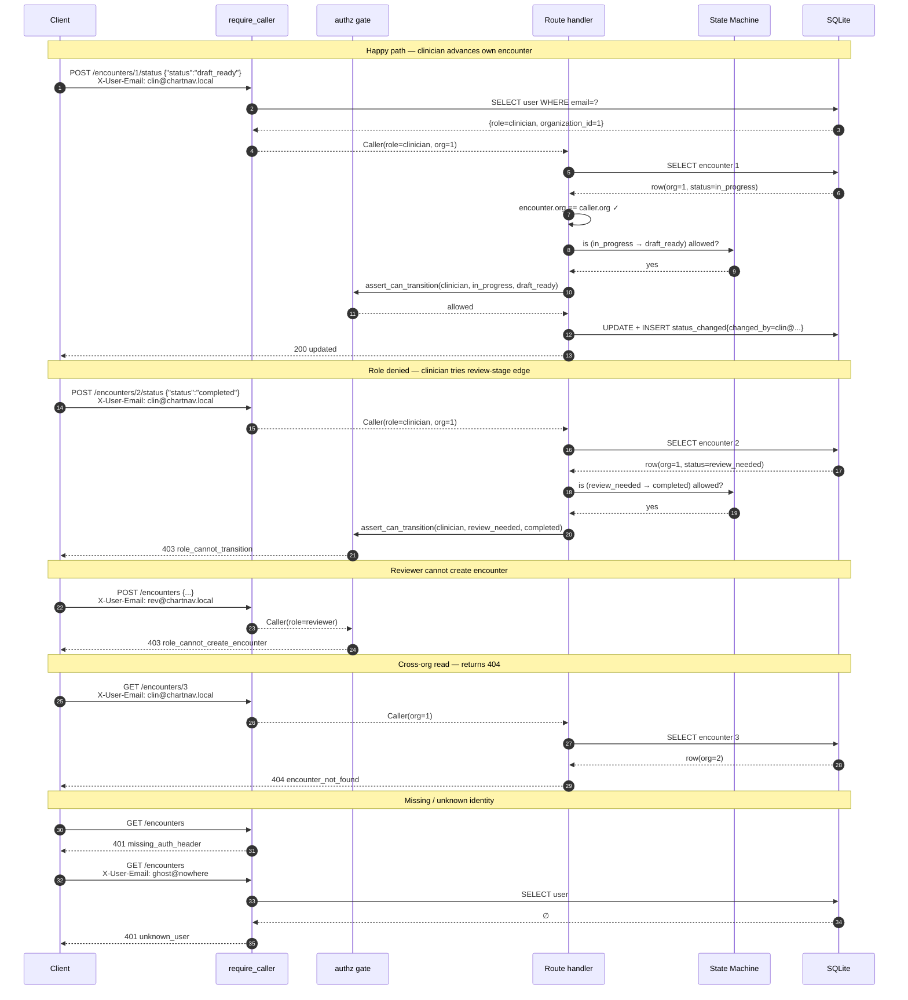

# API / Data Flow

```mermaid
sequenceDiagram
  autonumber
  participant C as Client
  participant Authn as require_caller
  participant Authz as authz gate
  participant R as Route handler
  participant SM as State Machine
  participant DB as SQLite

  Note over C,DB: Happy path — clinician advances own encounter
  C->>Authn: POST /encounters/1/status {"status":"draft_ready"}<br/>X-User-Email: clin@chartnav.local
  Authn->>DB: SELECT user WHERE email=?
  DB-->>Authn: {role=clinician, organization_id=1}
  Authn-->>R: Caller(role=clinician, org=1)
  R->>DB: SELECT encounter 1
  DB-->>R: row(org=1, status=in_progress)
  R->>R: encounter.org == caller.org ✓
  R->>SM: is (in_progress → draft_ready) allowed?
  SM-->>R: yes
  R->>Authz: assert_can_transition(clinician, in_progress, draft_ready)
  Authz-->>R: allowed
  R->>DB: UPDATE + INSERT status_changed{changed_by=clin@...}
  R-->>C: 200 updated

  Note over C,DB: Role denied — clinician tries review-stage edge
  C->>Authn: POST /encounters/2/status {"status":"completed"}<br/>X-User-Email: clin@chartnav.local
  Authn-->>R: Caller(role=clinician, org=1)
  R->>DB: SELECT encounter 2
  DB-->>R: row(org=1, status=review_needed)
  R->>SM: is (review_needed → completed) allowed?
  SM-->>R: yes
  R->>Authz: assert_can_transition(clinician, review_needed, completed)
  Authz-->>C: 403 role_cannot_transition

  Note over C,DB: Reviewer cannot create encounter
  C->>Authn: POST /encounters {...}<br/>X-User-Email: rev@chartnav.local
  Authn-->>Authz: Caller(role=reviewer)
  Authz-->>C: 403 role_cannot_create_encounter

  Note over C,DB: Cross-org read — returns 404
  C->>Authn: GET /encounters/3<br/>X-User-Email: clin@chartnav.local
  Authn-->>R: Caller(org=1)
  R->>DB: SELECT encounter 3
  DB-->>R: row(org=2)
  R-->>C: 404 encounter_not_found

  Note over C,DB: Missing / unknown identity
  C->>Authn: GET /encounters
  Authn-->>C: 401 missing_auth_header
  C->>Authn: GET /encounters<br/>X-User-Email: ghost@nowhere
  Authn->>DB: SELECT user
  DB-->>Authn: ∅
  Authn-->>C: 401 unknown_user
```
