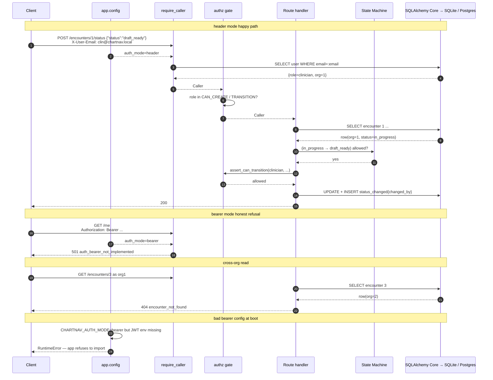
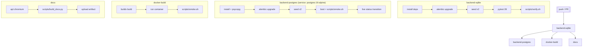

# API / Data Flow & CI

## Request path

```mermaid
sequenceDiagram
  autonumber
  participant C as Client
  participant Cfg as app.config
  participant Authn as require_caller
  participant Authz as authz gate
  participant R as Route handler
  participant SM as State Machine
  participant DB as SQLAlchemy Core → SQLite / Postgres

  Note over C,DB: header mode happy path
  C->>Authn: POST /encounters/1/status {"status":"draft_ready"}<br/>X-User-Email: clin@chartnav.local
  Cfg-->>Authn: auth_mode=header
  Authn->>DB: SELECT user WHERE email=:email
  DB-->>Authn: {role=clinician, org=1}
  Authn-->>Authz: Caller
  Authz->>Authz: role in CAN_CREATE / TRANSITION?
  Authz-->>R: Caller
  R->>DB: SELECT encounter 1 ...
  DB-->>R: row(org=1, status=in_progress)
  R->>SM: (in_progress → draft_ready) allowed?
  SM-->>R: yes
  R->>Authz: assert_can_transition(clinician, ...)
  Authz-->>R: allowed
  R->>DB: UPDATE + INSERT status_changed{changed_by}
  R-->>C: 200

  Note over C,DB: bearer mode honest refusal
  C->>Authn: GET /me<br/>Authorization: Bearer ...
  Cfg-->>Authn: auth_mode=bearer
  Authn-->>C: 501 auth_bearer_not_implemented

  Note over C,DB: cross-org read
  C->>Authn: GET /encounters/3 as org1
  R->>DB: SELECT encounter 3
  DB-->>R: row(org=2)
  R-->>C: 404 encounter_not_found

  Note over C,DB: bad bearer config at boot
  Cfg->>Cfg: CHARTNAV_AUTH_MODE=bearer but JWT env missing
  Cfg-->>C: RuntimeError — app refuses to import
```

## CI gate flow

```mermaid
flowchart TD
  PR[["push / PR"]] --> SQL[backend-sqlite]
  SQL --> PG[backend-postgres]
  SQL --> DK[docker-build]
  SQL --> DOC[docs]

  subgraph "backend-sqlite"
    A1[install deps] --> A2[alembic upgrade]
    A2 --> A3[seed x2]
    A3 --> A4[pytest 28]
    A4 --> A5[scripts/verify.sh]
  end

  subgraph "backend-postgres (service: postgres:16-alpine)"
    B1[install + psycopg] --> B2[alembic upgrade]
    B2 --> B3[seed x2]
    B3 --> B4[boot + scripts/smoke.sh]
    B4 --> B5[live status transition]
  end

  subgraph "docker-build"
    D1[buildx build] --> D2[run container]
    D2 --> D3[scripts/smoke.sh]
  end

  subgraph "docs"
    X1[apt chromium] --> X2[scripts/build_docs.py]
    X2 --> X3[upload artifact]
  end
```

Any red-bordered step failing fails CI.
