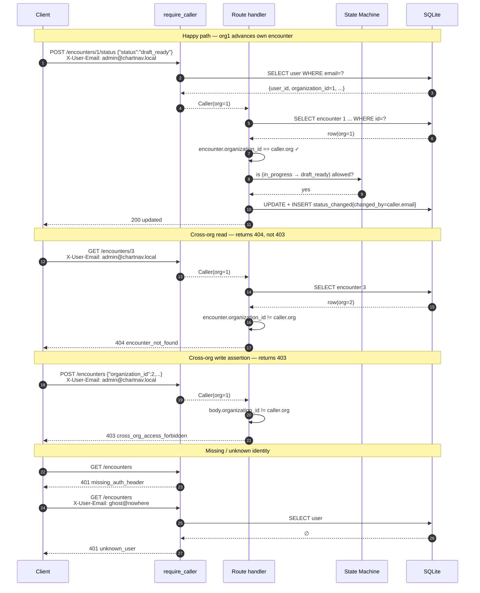

# API / Data Flow

```mermaid
sequenceDiagram
  autonumber
  participant C as Client
  participant Auth as require_caller
  participant R as Route handler
  participant SM as State Machine
  participant DB as SQLite

  Note over C,DB: Happy path — org1 advances own encounter
  C->>Auth: POST /encounters/1/status {"status":"draft_ready"}<br/>X-User-Email: admin@chartnav.local
  Auth->>DB: SELECT user WHERE email=?
  DB-->>Auth: {user_id, organization_id=1, ...}
  Auth-->>R: Caller(org=1)
  R->>DB: SELECT encounter 1 ... WHERE id=?
  DB-->>R: row(org=1)
  R->>R: encounter.organization_id == caller.org ✓
  R->>SM: is (in_progress → draft_ready) allowed?
  SM-->>R: yes
  R->>DB: UPDATE + INSERT status_changed{changed_by=caller.email}
  R-->>C: 200 updated

  Note over C,DB: Cross-org read — returns 404, not 403
  C->>Auth: GET /encounters/3<br/>X-User-Email: admin@chartnav.local
  Auth-->>R: Caller(org=1)
  R->>DB: SELECT encounter 3
  DB-->>R: row(org=2)
  R->>R: encounter.organization_id != caller.org
  R-->>C: 404 encounter_not_found

  Note over C,DB: Cross-org write assertion — returns 403
  C->>Auth: POST /encounters {"organization_id":2,...}<br/>X-User-Email: admin@chartnav.local
  Auth-->>R: Caller(org=1)
  R->>R: body.organization_id != caller.org
  R-->>C: 403 cross_org_access_forbidden

  Note over C,DB: Missing / unknown identity
  C->>Auth: GET /encounters
  Auth-->>C: 401 missing_auth_header
  C->>Auth: GET /encounters<br/>X-User-Email: ghost@nowhere
  Auth->>DB: SELECT user
  DB-->>Auth: ∅
  Auth-->>C: 401 unknown_user
```
