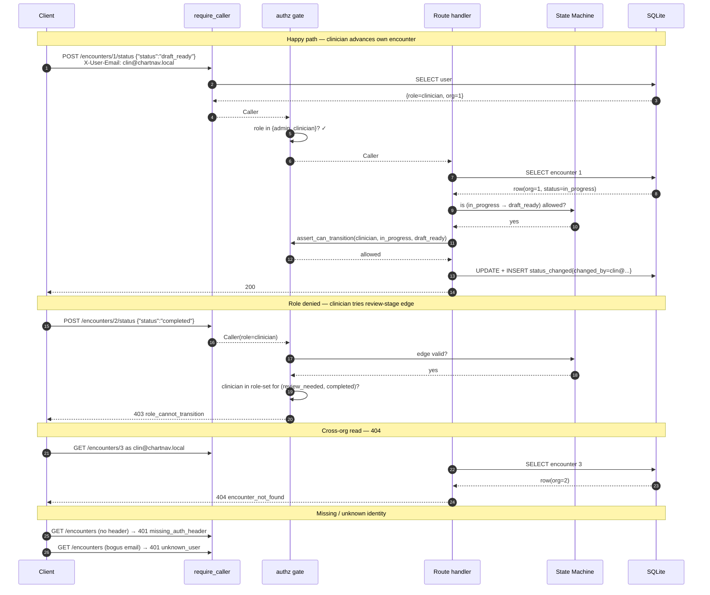

# API / Data Flow & CI

## Request path (happy + denial)



## CI gate flow

```mermaid
flowchart TD
  PR[["push / PR"]]
  subgraph backend job
    A[checkout] --> B[setup-python 3.11]
    B --> C["pip install -e \".[dev]\""]
    C --> D["alembic -x url=... upgrade head<br/>(isolated CI DB)"]
    D --> E["seed twice (idempotency)"]
    E --> F["pytest tests/ -v"]
    F --> G["boot uvicorn + poll /health"]
    G --> H["scripts/smoke.sh"]
  end
  subgraph docs job
    I[checkout] --> J[apt chromium]
    J --> K["python scripts/build_docs.py"]
    K --> L["upload HTML + PDF artifact"]
  end
  PR --> A
  H --> I
  classDef fail fill:#fee,stroke:#c33
  class F,G,H,K,L fail
```

Any failure in a red-bordered step fails CI.
