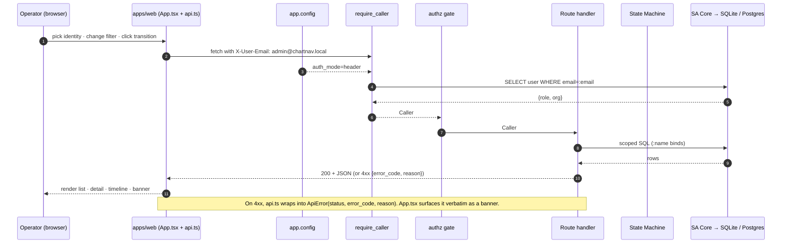
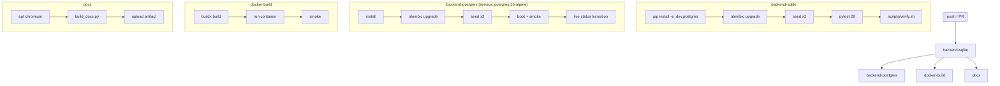

# API / Data Flow & CI

## UI → Backend request path



## Role-aware transition flow

```mermaid
sequenceDiagram
  autonumber
  participant W as App.tsx
  participant A as api.allowedNextStatuses()
  participant B as POST /encounters/{id}/status
  participant Authz as authz.assert_can_transition

  W->>A: compute buttons for (role, current)
  A-->>W: [next1, next2, ...]  (UI hint only)
  W->>B: POST status=next
  B->>Authz: validate state-machine edge + role edge
  alt allowed
    Authz-->>B: ok
    B-->>W: 200 updated encounter
    W->>W: refresh detail + events + list; green banner
  else role forbidden
    Authz-->>W: 403 role_cannot_transition
    W->>W: red banner; UI affordances unchanged until next refresh
  end
```

## CI gate flow


