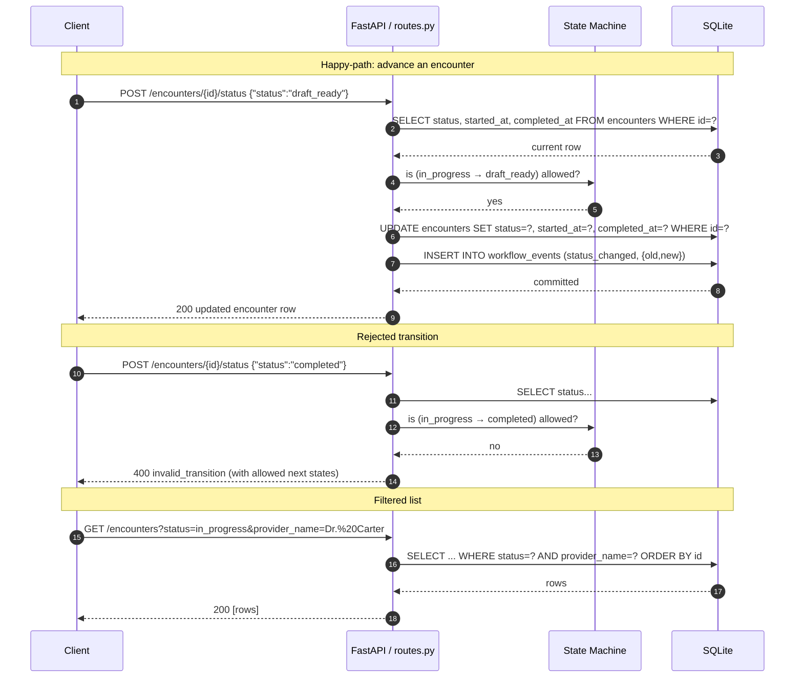

# API / Data Flow

```mermaid
sequenceDiagram
  autonumber
  participant C as Client
  participant A as FastAPI / routes.py
  participant SM as State Machine
  participant DB as SQLite

  Note over C,DB: Happy-path: advance an encounter
  C->>A: POST /encounters/{id}/status {"status":"draft_ready"}
  A->>DB: SELECT status, started_at, completed_at FROM encounters WHERE id=?
  DB-->>A: current row
  A->>SM: is (in_progress → draft_ready) allowed?
  SM-->>A: yes
  A->>DB: UPDATE encounters SET status=?, started_at=?, completed_at=? WHERE id=?
  A->>DB: INSERT INTO workflow_events (status_changed, {old,new})
  DB-->>A: committed
  A-->>C: 200 updated encounter row

  Note over C,DB: Rejected transition
  C->>A: POST /encounters/{id}/status {"status":"completed"}
  A->>DB: SELECT status...
  A->>SM: is (in_progress → completed) allowed?
  SM-->>A: no
  A-->>C: 400 invalid_transition (with allowed next states)

  Note over C,DB: Filtered list
  C->>A: GET /encounters?status=in_progress&provider_name=Dr.%20Carter
  A->>DB: SELECT ... WHERE status=? AND provider_name=? ORDER BY id
  DB-->>A: rows
  A-->>C: 200 [rows]
```
