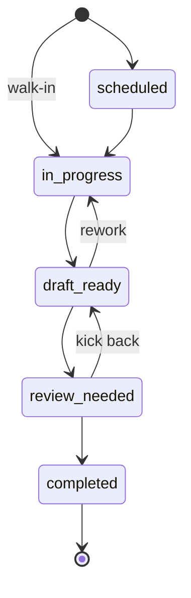

# Encounter Status State Machine

```mermaid
stateDiagram-v2
  [*] --> scheduled
  [*] --> in_progress : walk-in

  scheduled --> in_progress

  in_progress --> draft_ready

  draft_ready --> review_needed
  draft_ready --> in_progress : rework

  review_needed --> completed
  review_needed --> draft_ready : kick back

  completed --> [*]
```

Legend: any edge not shown is rejected at `POST /encounters/{id}/status`
with HTTP 400 `invalid_transition`.
