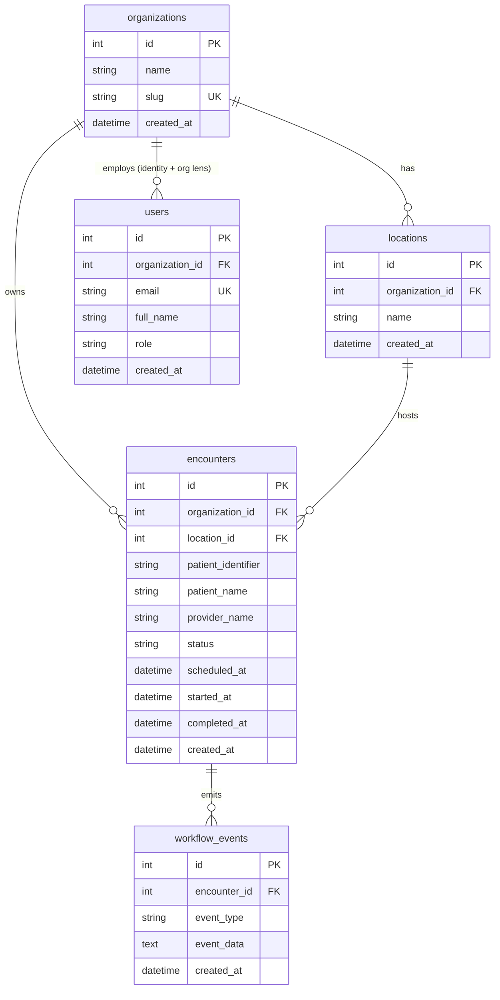

# ER Diagram

## Dev auth note

`users.email` is the authentication key consumed from the `X-User-Email`
header. `users.organization_id` is the authoritative source of the
caller's organization scope — never derived from body or query params.

## Seeded tenants

| org_id | slug               | admin email             | location_id | encounter_ids |
|--------|--------------------|-------------------------|-------------|---------------|
| 1      | `demo-eye-clinic`  | admin@chartnav.local    | 1           | 1, 2          |
| 2      | `northside-retina` | admin@northside.local   | 2           | 3             |
