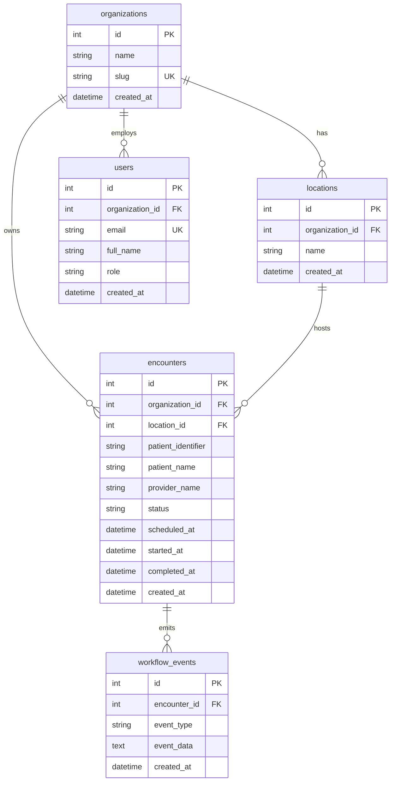

# ER Diagram

```mermaid
erDiagram
  organizations ||--o{ locations     : "has"
  organizations ||--o{ users         : "employs"
  organizations ||--o{ encounters    : "owns"
  locations     ||--o{ encounters    : "hosts"
  encounters    ||--o{ workflow_events : "emits"

  organizations {
    int id PK
    string name
    string slug UK
    datetime created_at
  }
  locations {
    int id PK
    int organization_id FK
    string name
    datetime created_at
  }
  users {
    int id PK
    int organization_id FK
    string email UK
    string full_name
    string role
    datetime created_at
  }
  encounters {
    int id PK
    int organization_id FK
    int location_id FK
    string patient_identifier
    string patient_name
    string provider_name
    string status
    datetime scheduled_at
    datetime started_at
    datetime completed_at
    datetime created_at
  }
  workflow_events {
    int id PK
    int encounter_id FK
    string event_type
    text event_data
    datetime created_at
  }
```
