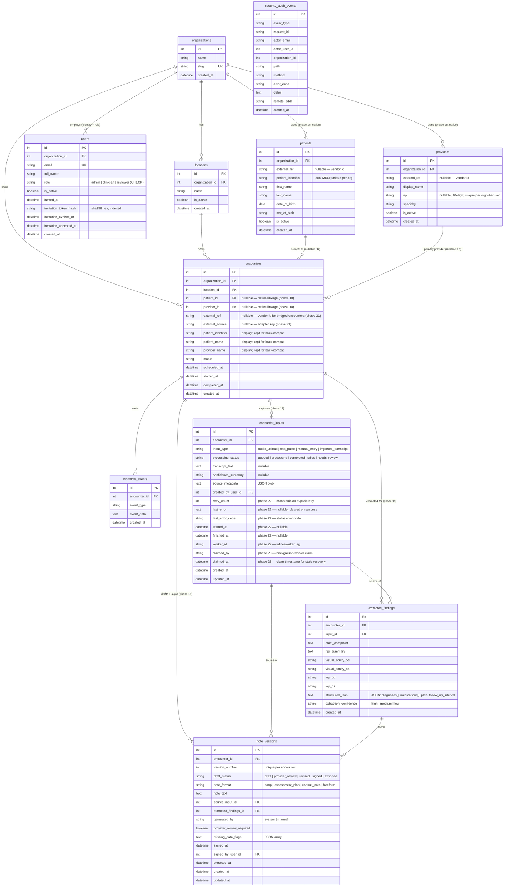

# ER Diagram

## Seeded tenants & users

| org_id | slug               | email                    | role      |
|--------|--------------------|--------------------------|-----------|
| 1      | `demo-eye-clinic`  | admin@chartnav.local     | admin     |
| 1      | `demo-eye-clinic`  | clin@chartnav.local      | clinician |
| 1      | `demo-eye-clinic`  | rev@chartnav.local       | reviewer  |
| 2      | `northside-retina` | admin@northside.local    | admin     |
| 2      | `northside-retina` | clin@northside.local     | clinician |

`users.email` is the authentication key consumed from `X-User-Email`.
`users.role` is the RBAC key consumed by `app.authz`.
`users.organization_id` is the authoritative source of scope; never
derived from client input.
