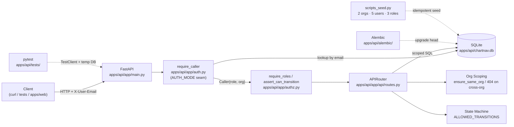

# System Architecture

```mermaid
flowchart LR
  Client["Client<br/>(curl / tests / apps/web)"]
  FastAPI["FastAPI<br/>apps/api/app/main.py"]
  Authn["require_caller<br/>apps/api/app/auth.py<br/>(AUTH_MODE seam)"]
  Authz["require_roles / assert_can_transition<br/>apps/api/app/authz.py"]
  Router["APIRouter<br/>apps/api/app/api/routes.py"]
  SM["State Machine<br/>ALLOWED_TRANSITIONS"]
  Scope["Org Scoping<br/>ensure_same_org / 404 on cross-org"]
  DB[("SQLite<br/>apps/api/chartnav.db")]
  Alembic["Alembic<br/>apps/api/alembic/"]
  Seed["scripts_seed.py<br/>2 orgs · 5 users · 3 roles"]
  Tests["pytest<br/>apps/api/tests/"]

  Client -->|"HTTP + X-User-Email"| FastAPI
  FastAPI --> Authn
  Authn -->|"lookup by email"| DB
  Authn -->|"Caller(role, org)"| Authz
  Authz --> Router
  Router --> Scope
  Router --> SM
  Router -->|"scoped SQL"| DB
  Alembic -.->|"upgrade head"| DB
  Seed -.->|"idempotent seed"| DB
  Tests -.->|"TestClient + temp DB"| FastAPI
```
