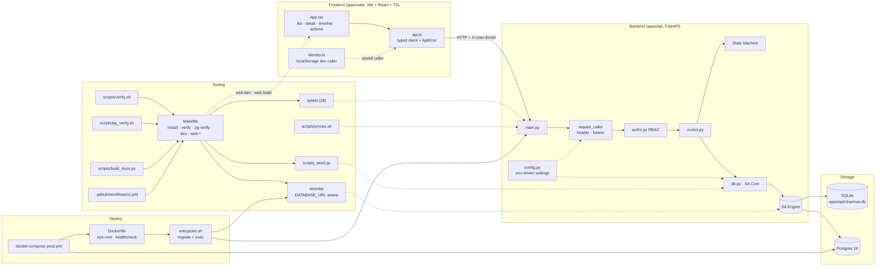

# System Architecture

```mermaid
flowchart LR
  subgraph Web["Frontend (apps/web, Vite + React + TS)"]
    UI["App.tsx<br/>list · detail · timeline · actions"]
    ApiClient["api.ts<br/>typed client + ApiError"]
    Ident["identity.ts<br/>localStorage dev caller"]
  end

  subgraph Runtime["Backend (apps/api, FastAPI)"]
    FastAPI["main.py"]
    Config["config.py<br/>env-driven settings"]
    Authn["require_caller<br/>header · bearer"]
    Authz["authz.py RBAC"]
    Router["routes.py"]
    SM["State Machine"]
    DB["db.py · SA Core"]
    Engine[(SA Engine)]
  end

  subgraph Storage
    SQLite[("SQLite<br/>apps/api/chartnav.db")]
    PG[("Postgres 16")]
  end

  subgraph Deploy
    Dockerfile["Dockerfile<br/>non-root · healthcheck"]
    Entry["entrypoint.sh<br/>migrate + exec"]
    Compose["docker-compose.prod.yml"]
  end

  subgraph Tooling
    Alembic["Alembic<br/>DATABASE_URL-aware"]
    Seed["scripts_seed.py"]
    PyTest["pytest (28)"]
    Smoke["scripts/smoke.sh"]
    Verify["scripts/verify.sh"]
    PgVerify["scripts/pg_verify.sh"]
    DocBuild["scripts/build_docs.py"]
    Make["Makefile<br/>install · verify · pg-verify · dev · web-*"]
    CI[".github/workflows/ci.yml"]
  end

  UI --> ApiClient
  ApiClient -->|"HTTP + X-User-Email"| FastAPI
  Ident -. stored caller .-> ApiClient

  FastAPI --> Authn
  Authn --> Authz
  Authz --> Router
  Router --> SM
  Router --> DB
  DB --> Engine
  Engine --> SQLite
  Engine --> PG
  Config -.-> Authn
  Config -.-> DB

  Alembic -.-> Engine
  Seed -.-> DB
  PyTest -.-> FastAPI
  Smoke -.-> FastAPI
  Verify --> Make
  PgVerify --> Make
  DocBuild --> Make
  Make --> Alembic
  Make --> Seed
  Make --> PyTest
  Make -. web-dev · web-build .-> UI
  CI --> Make
  Dockerfile --> Entry
  Entry --> Alembic
  Entry --> FastAPI
  Compose --> Dockerfile
  Compose --> PG
```
