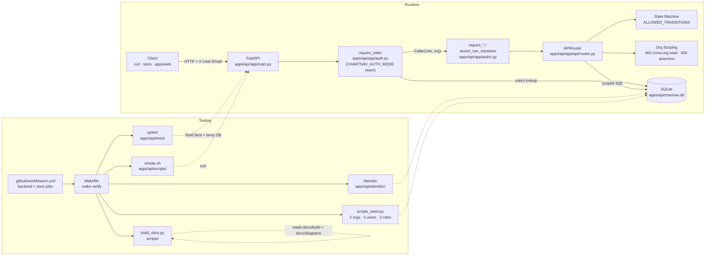

# System Architecture

```mermaid
flowchart LR
  subgraph Runtime
    Client["Client<br/>curl · tests · apps/web"]
    FastAPI["FastAPI<br/>apps/api/app/main.py"]
    Authn["require_caller<br/>apps/api/app/auth.py<br/>(CHARTNAV_AUTH_MODE seam)"]
    Authz["require_* / assert_can_transition<br/>apps/api/app/authz.py"]
    Router["APIRouter<br/>apps/api/app/api/routes.py"]
    SM["State Machine<br/>ALLOWED_TRANSITIONS"]
    Scope["Org Scoping<br/>404 cross-org read · 403 assertion"]
    DB[("SQLite<br/>apps/api/chartnav.db")]
  end
  subgraph Tooling
    Alembic["Alembic<br/>apps/api/alembic/"]
    Seed["scripts_seed.py<br/>2 orgs · 5 users · 3 roles"]
    PyTest["pytest<br/>apps/api/tests/"]
    Smoke["smoke.sh<br/>apps/api/scripts/"]
    DocBuild["build_docs.py<br/>scripts/"]
    Make["Makefile<br/>make verify"]
    CI[".github/workflows/ci.yml<br/>backend + docs jobs"]
  end

  Client -->|"HTTP + X-User-Email"| FastAPI
  FastAPI --> Authn
  Authn -->|"users lookup"| DB
  Authn -->|"Caller(role, org)"| Authz
  Authz --> Router
  Router --> Scope
  Router --> SM
  Router -->|"scoped SQL"| DB

  Alembic -.-> DB
  Seed -.-> DB
  PyTest -.->|"TestClient + temp DB"| FastAPI
  Smoke -.->|"curl"| FastAPI
  DocBuild -.->|"reads docs/build + docs/diagrams"| DocBuild
  Make --> Alembic
  Make --> Seed
  Make --> PyTest
  Make --> Smoke
  Make --> DocBuild
  CI --> Make
```
