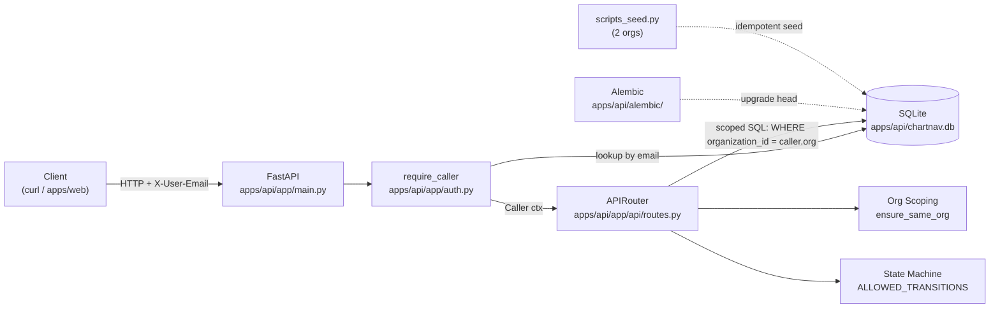

# System Architecture

```mermaid
flowchart LR
  Client["Client<br/>(curl / apps/web)"]
  FastAPI["FastAPI<br/>apps/api/app/main.py"]
  Auth["require_caller<br/>apps/api/app/auth.py"]
  Router["APIRouter<br/>apps/api/app/api/routes.py"]
  SM["State Machine<br/>ALLOWED_TRANSITIONS"]
  Scope["Org Scoping<br/>ensure_same_org"]
  DB[("SQLite<br/>apps/api/chartnav.db")]
  Alembic["Alembic<br/>apps/api/alembic/"]
  Seed["scripts_seed.py<br/>(2 orgs)"]

  Client -->|"HTTP + X-User-Email"| FastAPI
  FastAPI --> Auth
  Auth -->|"lookup by email"| DB
  Auth -->|"Caller ctx"| Router
  Router --> Scope
  Router --> SM
  Router -->|"scoped SQL: WHERE organization_id = caller.org"| DB
  Alembic -.->|"upgrade head"| DB
  Seed -.->|"idempotent seed"| DB
```
