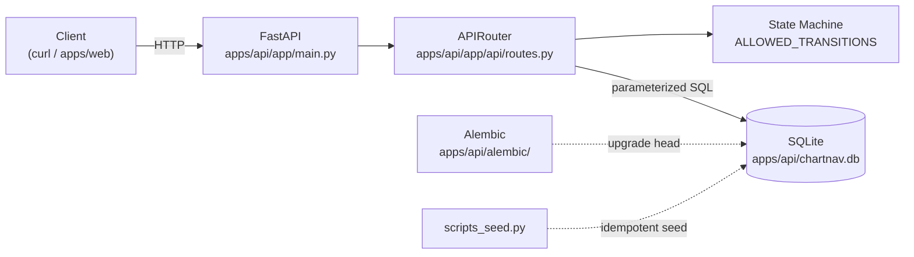

# System Architecture

```mermaid
flowchart LR
  Client["Client<br/>(curl / apps/web)"]
  FastAPI["FastAPI<br/>apps/api/app/main.py"]
  Router["APIRouter<br/>apps/api/app/api/routes.py"]
  SM["State Machine<br/>ALLOWED_TRANSITIONS"]
  DB[("SQLite<br/>apps/api/chartnav.db")]
  Alembic["Alembic<br/>apps/api/alembic/"]
  Seed["scripts_seed.py"]

  Client -->|HTTP| FastAPI --> Router
  Router --> SM
  Router -->|parameterized SQL| DB
  Alembic -.->|upgrade head| DB
  Seed -.->|idempotent seed| DB
```
