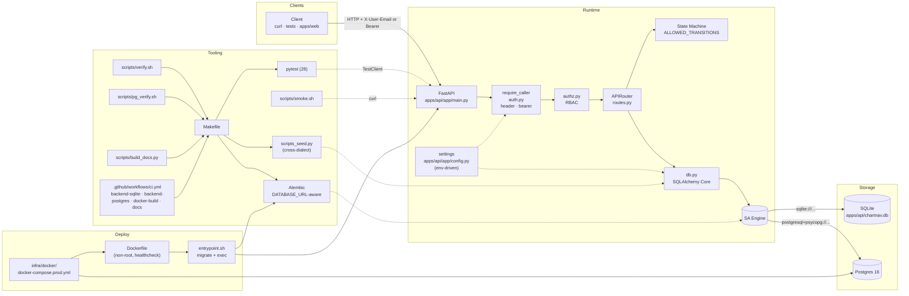

# System Architecture

```mermaid
flowchart LR
  subgraph Clients
    C["Client<br/>curl · tests · apps/web"]
  end

  subgraph Runtime
    FastAPI["FastAPI<br/>apps/api/app/main.py"]
    Config["settings<br/>apps/api/app/config.py<br/>(env-driven)"]
    Authn["require_caller<br/>auth.py<br/>header · bearer"]
    Authz["authz.py<br/>RBAC"]
    Router["APIRouter<br/>routes.py"]
    SM["State Machine<br/>ALLOWED_TRANSITIONS"]
    DB["db.py<br/>SQLAlchemy Core"]
    Engine[(SA Engine)]
  end

  subgraph Storage
    SQLite[("SQLite<br/>apps/api/chartnav.db")]
    PG[("Postgres 16")]
  end

  subgraph Deploy
    Dockerfile["Dockerfile<br/>(non-root, healthcheck)"]
    Entry["entrypoint.sh<br/>migrate + exec"]
    Compose["infra/docker/<br/>docker-compose.prod.yml"]
  end

  subgraph Tooling
    Alembic["Alembic<br/>DATABASE_URL-aware"]
    Seed["scripts_seed.py<br/>(cross-dialect)"]
    PyTest["pytest (28)"]
    Smoke["scripts/smoke.sh"]
    Verify["scripts/verify.sh"]
    PgVerify["scripts/pg_verify.sh"]
    DocBuild["scripts/build_docs.py"]
    Make["Makefile"]
    CI[".github/workflows/ci.yml<br/>backend-sqlite · backend-postgres · docker-build · docs"]
  end

  C -->|"HTTP + X-User-Email or Bearer"| FastAPI
  FastAPI --> Authn
  Authn --> Authz
  Authz --> Router
  Router --> SM
  Router --> DB
  DB --> Engine
  Engine -->|"sqlite:///..."| SQLite
  Engine -->|"postgresql+psycopg://..."| PG
  Config -.-> Authn
  Config -.-> DB

  Alembic -.-> Engine
  Seed -.-> DB
  PyTest -.->|"TestClient"| FastAPI
  Smoke -.->|"curl"| FastAPI
  Verify --> Make
  PgVerify --> Make
  DocBuild --> Make
  Make --> Alembic
  Make --> Seed
  Make --> PyTest
  CI --> Make
  Dockerfile --> Entry
  Entry --> Alembic
  Entry --> FastAPI
  Compose --> Dockerfile
  Compose --> PG
```
